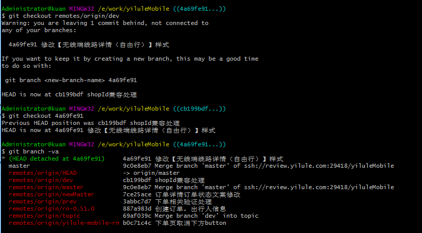

# git

* 下载github上指定目录到本地电脑文件夹

```
//要下载的文件夹 
https://github.com/Aaaaaaaty/Blog/blob/master/canvas/canvasVideo/index.html

//需要将分支文件路径改一下 （ blob/master --> trunk ）
https://github.com/Aaaaaaaty/Blog/trunk/canvas/canvasVideo/index.html

//在使用svn工具 checkout 就可以了
```

* git切换不到远程分支，在游离分支上做了add commit 等操作

解决：切换到游离分支，然后 git checkout -b dev

就可以切换到dev分支

[https://www.cnblogs.com/xiaouisme/p/5754656.html](https://www.cnblogs.com/xiaouisme/p/5754656.html)


