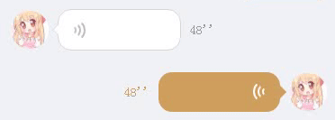

# 语音播放动画

* 小程序demo



* wxml

```
<template name="audioAni">
    <view class="audio-ani-box {{style ? style : ''}}">
        <view class="line line1"></view>
        <view class="line line2"></view>
        <view class="line line3"></view>
    </view>
</template>
```

* wxss

```
/*ani  */
.start {
    animation-iteration-count: infinite;
    animation-duration: 1.3s;
    animation-fill-mode: both;
}

.audio-ani-box {
    width: 42rpx;
    height: 42rpx;
    position: absolute;
    left: 30rpx;
    top: 50%;
    transform: translate(0, -50%);
}

.audio-ani-box .line {
    border-radius: 50%;
    border: 5rpx solid transparent;
    border-right-color: #bfbfbf;
    position: absolute;
    top: 50%;
    transform: translate(-100%, -50%);
}

.audio-ani-box .line1 {
    width: 14rpx;
    height: 14rpx;
    left: 10rpx;
    animation-name: fade1;
}

.audio-ani-box .line2 {
    width: 28rpx;
    height: 28rpx;
    left: 20rpx;
    animation-name: fade2;
}

.audio-ani-box .line3 {
    width: 42rpx;
    height: 42rpx;
    left: 30rpx;
    animation-name: fade3;
}

@keyframes fade1 {
    0% {
        opacity: 0;
    }

    10% {
        opacity: 0;
    }

    20% {
        opacity: 1;
    }
}

@keyframes fade2 {
    0% {
        opacity: 0;
    }

    30% {
        opacity: 0;
    }

    40% {
        opacity: 1;
    }
}

@keyframes fade3 {
    0% {
        opacity: 0;
    }

    40% {
        opacity: 0;
    }

    50% {
        opacity: 1;
    }
}
```

* 使用
  * style 参数用来重写默认样式

```
  <template is="audioAni" data="{{style : 'style'}}"/>
```
