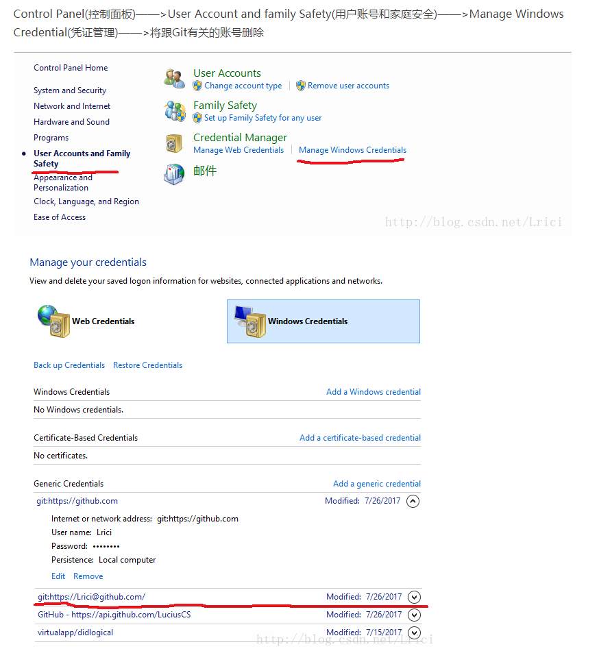

# 遇到的坑

* git不能clone了

```
http://blog.csdn.net/u014343528/article/details/48787221
```

* windows系统升级nodejs , 项目运行报错 %1 is not a valid win32 application

```
https://github.com/ElemeFE/cooking/issues/138

npm uninstall sass-loader
npm install sass-loader
```

* border-radius 让 overflow : hidden 失效；

```
http://www.cnblogs.com/wzy0625/p/5775780.html

transform: rotate(0deg);
```

* 添加本地项目到github 远程仓库

```
http://blog.csdn.net/xiahouzuoxin/article/details/9398629

git init                
git add .             
git commit -m "My first commit operation" 
git remote add origin https://github.com/zhongs/haier
git push origin master
```

* windows 删除已安装的mysql

```
http://blog.csdn.net/liangxz0311/article/details/45893607
```

* node-sass 一般安装的时候会报错，解决方法使用如下命令安装

```
https://segmentfault.com/q/1010000006098542/a-1020000006099451

npm install --save-dev node-sass --registry=https://registry.npm.taobao.org --disturl=https://npm.taobao.org/dist --sass-binary-site=http://npm.taobao.org/mirrors/node-sass
```

* ****[**GitHub "remote: Permission to account/somefile.git denied to account**](http://blog.csdn.net/Lrici/article/details/76169327)****



* npm 下载uri指定本地内网ip 不能下载第三方包；

```
npm config set registry https://registry.npm.taobao.org 
– 配置后可通过下面方式来验证是否成功 
npm config get registry 
– 或npm info express
```
